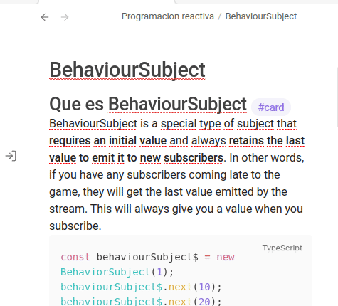

# Obsidian Speed Reading Plugin

A plugin to enable speed reading using the RSVP (Rapid Serial Visual Presentation) technique. Select text in your note and trigger a modal to display words at a user-controlled pace.

<p align="center">
  
</p>


## Features

- Command palette entry: **Speed Read Selected Text**
- Configurable hotkey trigger
- Modal dialog with RSVP display
- Start/Pause button
- Adjustable WPM (words per minute) control
- Close button
- Robust Markdown handling for clean reading experience
- Settings tab for default WPM and preferences
- User-configurable progress bar control
- Full mobile support

## Installation

1. **Build the plugin**  
   In your project directory, run:
   ```
   pnpm install
   pnpm run build
   ```
2. **Copy plugin files**  
   Copy the following files and folders to your Obsidian vault’s plugins directory (e.g., `YourVault/.obsidian/plugins/speed-reading`):
   - `manifest.json`
   - `styles.css`
   - `dist/main.js`
   - (For compatibility, also copy `dist/main.js` as `main.js` in the plugin root)

3. **Enable the plugin**  
   - Open Obsidian.
   - Go to `Settings` → `Community plugins` → `Installed plugins`.
   - Enable **Speed Reading**.

## Usage

1. Open a note and select the text you want to speed read.
2. Open the command palette (`Ctrl+P` or `Cmd+P`), search for **Speed Read Selected Text**, and run the command.
3. The RSVP modal will appear. Use the Start/Pause button and adjust WPM as needed.

## Development Notes
- Built with TypeScript and the Obsidian API.

## Future Enhancements

- Public release preparation (code review, linting, versioning, submission to community plugins)